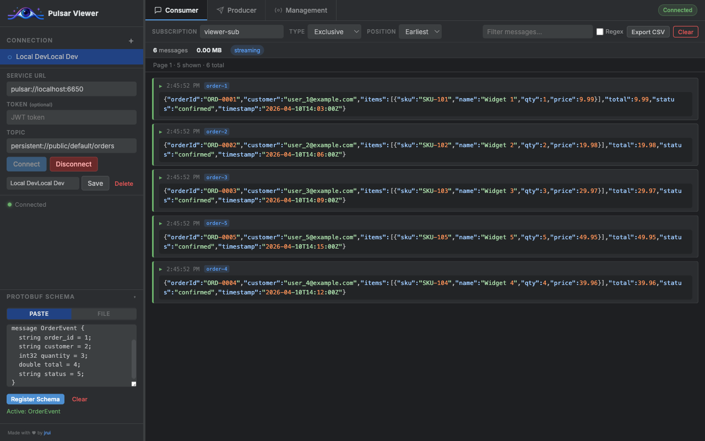
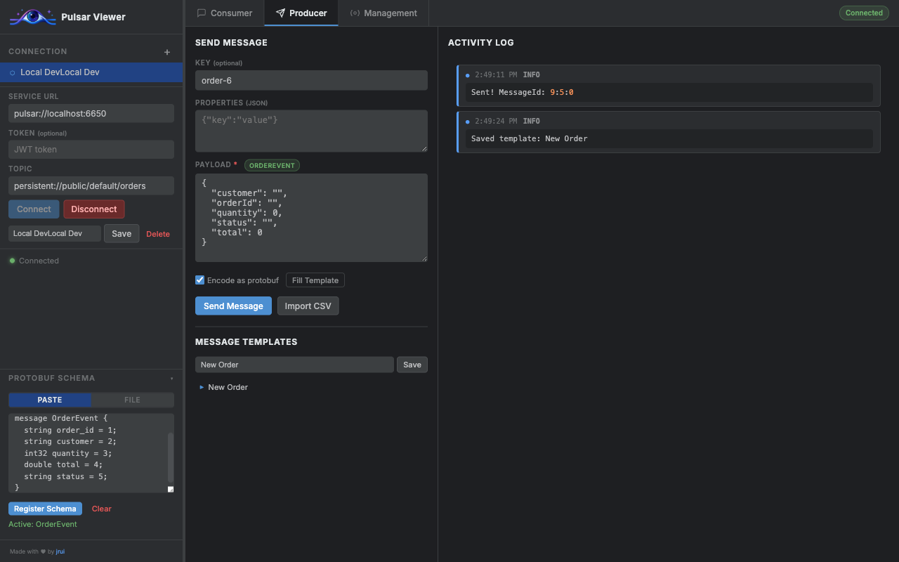
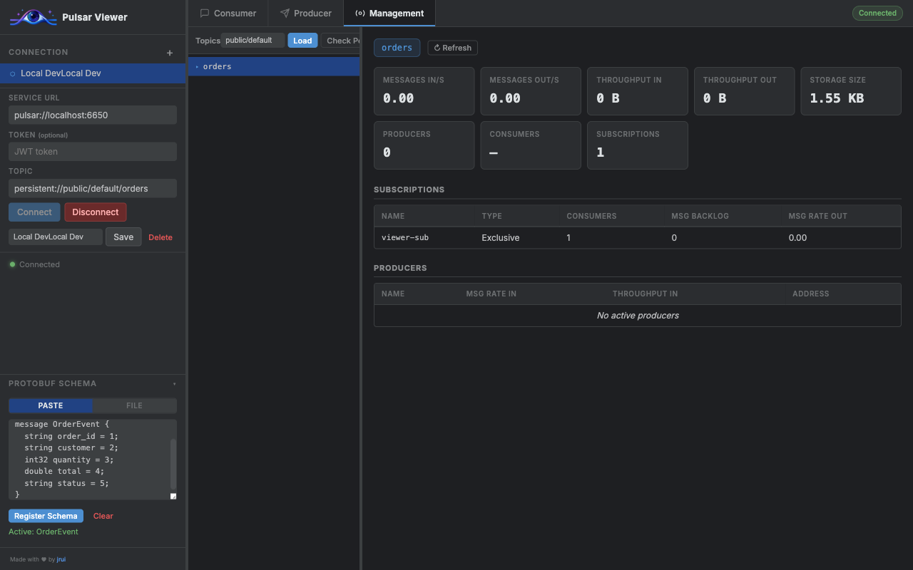

# Pulsar Viewer

A lightweight desktop application with Go backend and web UI to inspect, produce, and manage Apache Pulsar topics. Connect using a service URL (broker or proxy), optional token authentication, and stream messages live. Supports Protobuf schema decoding and reusable message templates.



---

## How to Use

### 1. Connect to a Pulsar cluster

Enter your **Service URL** (e.g. `pulsar://localhost:6650`), an optional **JWT token** for authentication, and the full **topic name** (e.g. `persistent://public/default/my-topic`). Click **Connect** to start consuming messages.

You can save connections for quick access — click **Save**, give it a name, and it will appear in the sidebar.

### 2. Consumer — browse messages


The **Consumer** tab streams messages in real time. Each message shows its timestamp, key, and payload.

- **Filter**: type in the filter box to search payloads. Enable **Regex** for pattern matching.
- **Position**: choose `Earliest` to replay from the beginning or `Latest` for new messages only.
- **Export CSV**: download the current message list as a CSV file.
- **Clear**: remove all messages from the viewer (does not affect the Pulsar topic).

### 3. Producer — send messages



Switch to the **Producer** tab to publish messages to the connected topic.

- Fill in an optional **Key**, optional **Properties** (JSON object), and the **Payload**.
- Click **Send Message** to publish. The **Activity Log** on the right confirms delivery with the message ID.
- **Import CSV**: bulk-send messages from a CSV file.
- **Message Templates**: save the current payload as a named template for reuse. Click a template name to load it.

### 4. Management — topic stats and admin



The **Management** tab provides an admin view of the connected namespace.

- Click **Load** to list all topics in the current namespace.
- Select a topic to see live statistics: message rates, throughput, storage size, active subscriptions, and connected producers.
- Use **Refresh** to update the stats on demand.
- **Check Permissions** validates your token's access to the selected topic.

### 5. Protobuf schema support

Expand the **Protobuf Schema** panel in the sidebar to enable Protobuf encoding/decoding:

1. Paste a `.proto` definition or drag-and-drop a `.proto` file.
2. Click **Register Schema** — the available message types are listed.
3. Select the message type to use.

Once active:
- Incoming consumer messages that match the schema are automatically decoded to JSON.
- In the Producer tab, a **protobuf** badge appears next to the Payload label, and an **Encode as protobuf** checkbox lets you send binary-encoded messages.
- Click **Fill Template** to populate the payload with a JSON skeleton matching the selected message type.

---

## Installation Options
### Pre-built binaries
Download installers for **macOS**, **Windows**, and **Linux** from [Releases](https://github.com/jrui/PulsarViewer/releases).

**macOS:** If Gatekeeper blocks the app (“Apple could not verify … free of malware”), remove the quarantine attribute and open from the CLI:  
`xattr -cr "/Applications/PulsarViewer.app" && open "/Applications/PulsarViewer.app"`

<br>

### Docker
```sh
docker pull ghcr.io/jrui/pulsarviewer:latest
docker run --rm -p 3000:3000 ghcr.io/jrui/pulsarviewer
```
Then open http://localhost:3000 in your browser.

<br>
<br>

## Local Development
### Run Backend + Frontend
```bash
npm run dev
# Backend runs on http://localhost:3000
```

<br>
<br>


## Building Desktop Apps
### Prerequisites
```bash
# Install Rust
curl --proto '=https' --tlsv1.2 -sSf https://sh.rustup.rs | sh

# Install Node dependencies
npm install
```

<br>

### Build for your platform
```bash
# macOS universal (Intel + Apple Silicon)
npm run tauri:build -- --target universal-apple-darwin

# Linux x64
npm run tauri:build -- --target x86_64-unknown-linux-gnu

# Windows x64
npm run tauri:build -- --target x86_64-pc-windows-msvc
```
Artifacts will be in `src-tauri/target/{target}/release/bundle/`


<br>
<br>


---
Made with 🤖 and ❤️ for quick troubleshooting.
